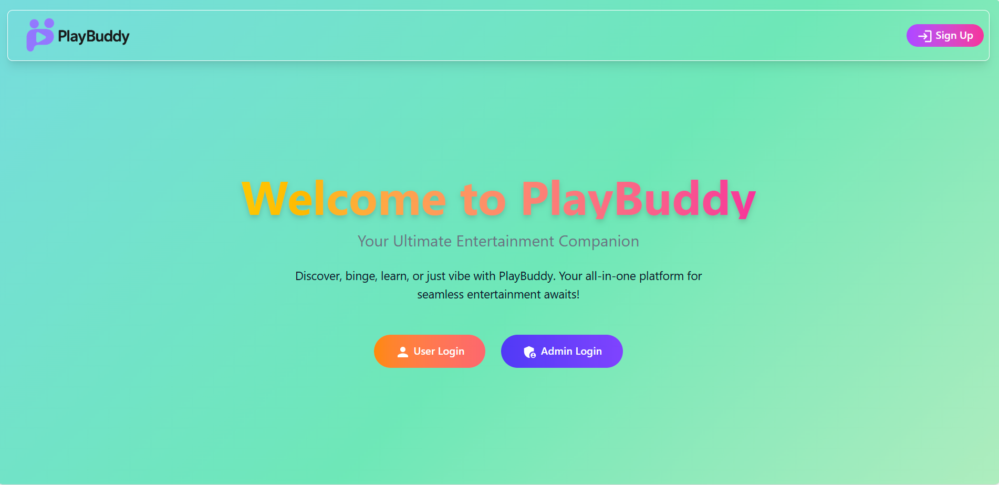
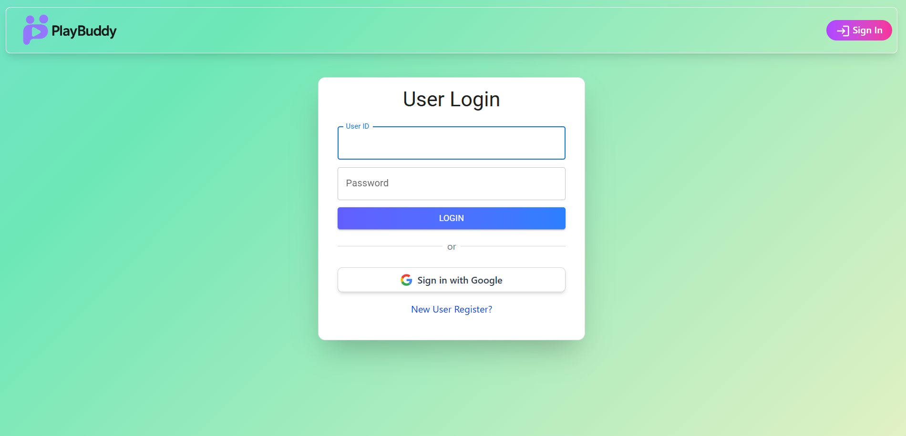
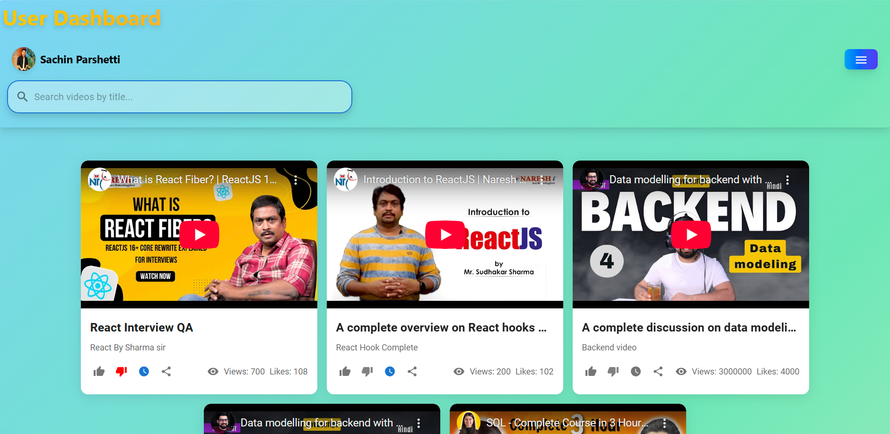
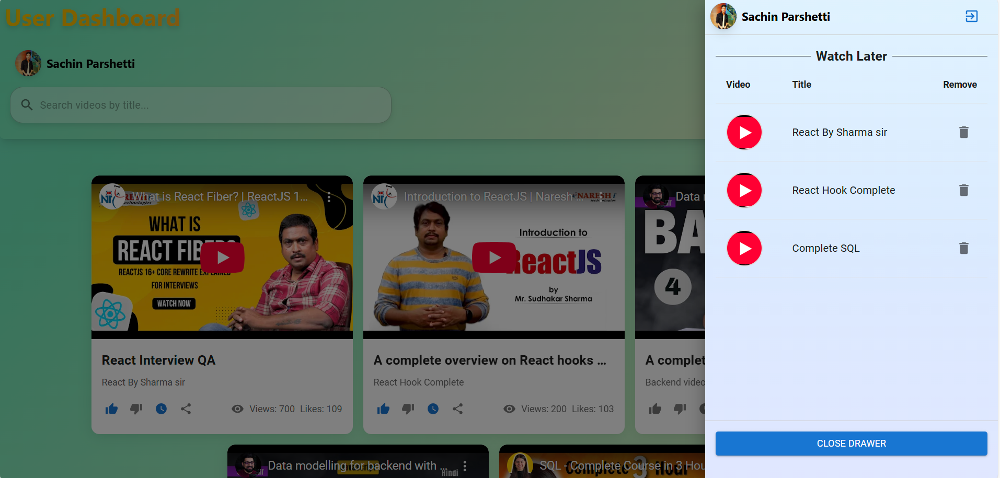
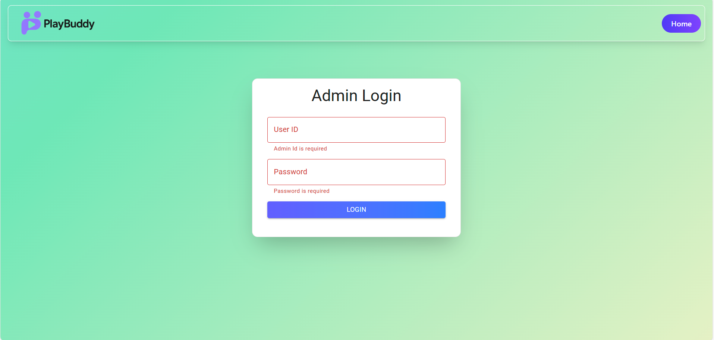

# 🎬 PlayBuddy (Video Library MERN Stack App)

A complete video management system using the MERN stack with custom numeric `category_id`. Includes secure authentication, a fully featured admin dashboard, and an interactive user interface.

---

## 🚀 Live Demo

- **Frontend (Netlify):** [https://your-netlify-app.netlify.app](https://your-netlify-app.netlify.app)
- **Backend (Render):** [https://video-library-backend.onrender.com](https://playbuddy.onrender.com)

---

## 🛠 Tech Stack

### Frontend
- React 19 + TypeScript
- Vite
- Tailwind CSS + MUI
- Redux Toolkit
- React Router DOM
- Formik & Yup
- SweetAlert2 + React Toastify

### Backend
- Node.js + Express.js (TypeScript)
- MongoDB + Mongoose
- JWT (HTTP-only cookie based)
- bcrypt
- dotenv

---

## 📸 Screenshots

### 🔐 Home Page  


### 🔐 User Login  


### 🔐 User Register  


### 👥 User Dashboard  


### 👥 User Dashboard - Watch Later  


### 🔐 Admin Login  


### 🧑‍💼 Admin Dashboard  


### 📂 Add Video  


---

## 📁 Folder Structure

```
video-library-2/
├── public/
│   ├── favicon.ico
│   └── vite.svg
├── server/
│   ├── config/
│   ├── controllers/
│   ├── dist/
│   ├── middleware/
│   ├── models/
│   ├── routes/
│   ├── services/
│   ├── utils/
│   ├── app.ts
│   ├── server.ts
│   └── tsconfig.json
├── src/
│   ├── assets/
│   ├── components/
│   │   ├── AdminDashboard/
│   │   ├── AdminLogin/
│   │   ├── Authentication/
│   │   ├── Error/
│   │   ├── LandingPage/
│   │   ├── Navbar/
│   │   ├── UserDashboard/
│   │   ├── userLogin/
│   │   └── userRegister/
│   ├── context/
│   ├── hooks/
│   ├── pages/
│   ├── Redux/
│   ├── App.tsx
│   ├── App.css
│   ├── index.css
│   └── main.tsx
├── .env
├── package.json
└── README.md

```


---

## 📦 Setup Instructions

### 🔧 Backend

```bash
cd server
npm install
```

`.env`:
```
PORT=4000
MONGO_URI=your_mongo_url
JWT_SECRET=your_jwt_secret
```

```bash
npm run dev    
npm run build   
npm start       
```

---

### 💻 Frontend

```bash
npm install
```

`.env`:
```
VITE_API_BASE_URL=https://video-library-backend.onrender.com
```

```bash
npm run dev    
npm run build   
```

> Add `_redirects` file in `public/`:
```
/*  /index.html  200
```

---

## ✨ Features

- ✅ Admin & User Auth
- ✅ Manage Categories (using `category_id`)
- ✅ Video CRUD operations
- ✅ Watch Later (user)
- ✅ Responsive UI
- ✅ Search by Video ID

---

## 🌐 Deployment

### 🟢 Render (Backend)
- Build: `npm run build`
- Start: `npm start`
- Env: `PORT`, `MONGO_URI`, `JWT_SECRET`

### 🔵 Netlify (Frontend)
- Build: `npm run build`
- Publish dir: `dist`
- Env: `VITE_API_BASE_URL`

---

## 🙋‍♂️ Author  
**Sachin Parashetti**  
🧑‍💻 Passionate Full-Stack Developer | MERN | REST APIs | UI/UX

- 📎 [GitHub – @SachinParashetti](https://github.com/SachinParashetti)
- 📎 [LinkedIn – sachin-parashetti](https://www.linkedin.com/in/sachin-parashetti-99b255259/)
- 📧 Email: [sachinparshettisp@gmail.com](mailto:sachinparshettisp@gmail.com)
---

## 📃 License

MIT © [Sachin Parashetti](https://github.com/SachinParashetti)